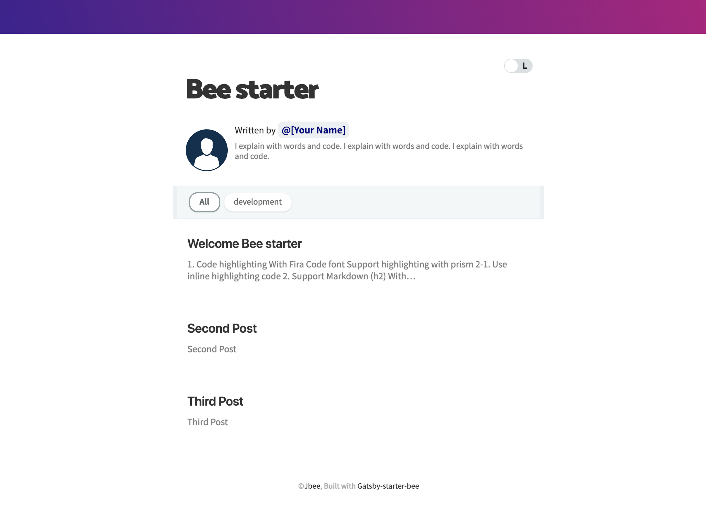

<div align="center">


</div>

# gatsby-starter-bee



[](https://travis-ci.org/JaeYeopHan/gatsby-starter-bee) [](https://greenkeeper.io/)
[](https://lgtm.com/projects/g/JaeYeopHan/gatsby-starter-bee/alerts/)
[](https://github.com/ebidel/lighthouse-badge)
[](https://github.com/dwyl/esta/issues)
[](https://app.netlify.com/sites/gatsby-starter-bee/deploys)

<a href="https://twitter.com/JbeeLjyhanll">

</a>

> Blog Starter Pack based on [gatsby-starter-blog](https://github.com/gatsbyjs/gatsby-starter-blog)

In this template...

- 💄 Fira Code 폰트로 코드 하이라이팅 기능
- 😄 Emoji 지원
- 🗣 Twitter, Facebook 등 SNS 공유 지원
- 💬 Disqus, utterances 댓글 기능 지원
- ☕ 'Buy me a coffee' 라는 후원 기능
- 🧙 포스트 작성을 위한 CLI 도구 지원
- 🤖 GA 지원
- ⭐ 여러 UX요소 추가
- ⚙ 별도 설정 파일을 통한 블로그 세부 사항 설정 지원

> [Gatsby Starters Docs](https://www.gatsbyjs.org/starters/JaeYeopHan/gatsby-starter-bee/)

## Demo

- [Default Theme](https://gatsby-starter-bee.netlify.com/)

## Use case

- [JBEE.io](https://jbee.io)
- [rinae's devlog](https://rinae.dev/)

> If you're using this template, Please Pull Request for `Use case`!

## 😎 Quick Start

### 1. Gatsby 프로젝트를 시작합니다.

```sh
# 이 블로그 스타터를 사용하여 gatsby 프로젝트를 시작할 수 있습니다.
$ npx gatsby new my-blog-starter https://github.com/JaeYeopHan/gatsby-starter-bee
```

> 만약 `npx`를 사용하고 있지 않는다면, [Gatsby Getting Started](https://www.gatsbyjs.org/docs/quick-start) 글을 참고하거나 아래 커맨드를 실행해주세요.

```sh
$ npm install -g gatsby-cli
$ gatsby new my-blog-starter https://github.com/JaeYeopHan/gatsby-starter-bee
```

### 2. 이제 로컬에서 확인하실 수 있습니다.

```sh
$ cd my-blog-starter/
$ npm start
# 브라우저에서 localhost:8000로 접근합니다.
```

### 3. 포스팅을 추가하세요.

다음 두 곳에서 포스팅을 추가할 수 있습니다.

- 블로그 포스팅은 `content/blog` 디렉토리에 추가해주세요.
- 웹에 올려둘 이력서는 `content/__about` 디렉토리에 추가해주세요.

> 몇 가지의 메타데이터와 마크다운 문법으로 포스팅을 작성할 수 있습니다.

#### 새로운 포스트를 작성할 때 커맨드라인을 통해 할 수 있습니다.


```sh
$ npm run post
```

위 커맨드를 입력하면 새로운 포스트가 생성됩니다.

### 4. 메타데이터 수정

`/gatsby-meta-config.js` 파일에서 블로그를 설정하는 여러 요소를 수정할 수 있습니다.

### 5. [Netlify](https://netlify.com)로 배포!

[](https://app.netlify.com/start/deploy?repository=https://github.com/JaeYeopHab/gatsby-starter-bee)

:bulb: github pages를 통해 배포하고 싶다면 아래 npm script를 `package.json`에 추가해주세요.

```json
"scripts": {
    "deploy": "gatsby build && gh-pages -d public -b master -r 'git@github.com:${your github id}/${github page name}.github.io.git'"
}
```

## 🧐 입맛에 맞게 바꾸기!

### ⚙ 설정

```
/root
├── gatsby-browser.js // font, polyfill, onClientRender ...
├── gatsby-config.js // Gatsby config
├── gatsby-meta-config.js // Template meta config
└── gatsby-node.js // Gatsby Node config
```

### ⛑ 구조

```
src
├── components // Just component with styling
├── layout // home, post layout
├── pages // routing except post: /(home), /about
├── styles
│   ├── code.scss
│   ├── dark-theme.scss
│   ├── light-theme.scss
│   └── variables.scss
└── templates
    ├── blog-post.js
    └── home.js
```

### 🎨 스타일

`src/styles` 디렉토리에서 CSS 속성들을 수정할 수 있습니다.

```
src/styles
├── code.scss
├── dark-theme.scss
├── light-theme.scss
└── variables.scss
```

### 🍭 꿀팁

- 프로필 사진! (replace file in `/content/assets/profile.png`)
- 파비콘 이미지! (replace file in `/content/assets/felog.png`)
- 헤더의 그라데이션! (\$theme-gradient `/styles/variables.scss`)

## ☕ 마음에 드셨나요?

<a href="https://www.buymeacoffee.com/jbee" target="_blank"></a>

## 🤔 If...

만약 현재 미디엄에서 블로그를 운영중이시라면 마이그레이션을 고려해보세요! [medium-to-own-blog](https://github.com/mathieudutour/medium-to-own-blog)!

## :bug: 버그제보

[Issue](https://github.com/JaeYeopHan/gatsby-starter-bee/issues)

## 🎁 기여하기

[Contributing guide](./CONTRIBUTING.md)

## LICENSE

[MIT](./LICENSE)

<div align="center">

<sub><sup>Project by <a href="https://github.com/JaeYeopHan">@Jbee</a></sup></sub><small>✌</small>

</div>
