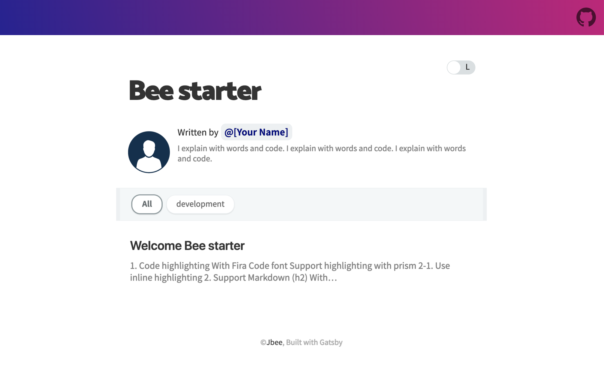

# gatsby-starter-bee

> Blog Starter Pack based on [gatsby-starter-blog](https://github.com/gatsbyjs/gatsby-starter-blog)

## Demo

- [Default Theme](https://gatsby-starter-bee.netlify.com/)

## Use case

- [JBEE.io](http://jbee.io)

## 😎 Quick Start

### 1. Create a Gatsby site.

```sh
# create a new Gatsby site using the blog starter
$ npx gatsby new my-blog-starter https://github.com/JaeYeopHan/gatsby-starter-bee
```

### 2. Start developing.

```sh
$ cd my-blog-starter/
$ npm start # gatsby develop
# open localhost:8080
```

### 3. Add your content

You can write...

- contents to blog in `content/blog` directory.
- resume `content/__about` directory.

> With markdown syntax and some meta data

### 4. Fix meta data

You can fix meta data of blog in `/gatsby-meta-config.js` file.

### 5. Publish with [netlify](https://netlify.com)

[](https://app.netlify.com/start/deploy?repository=https://github.com/JaeYeopHab/gatsby-starter-bee)

## 🧐 Customize!

### Gatsby config

```
/root
├── gatsby-browser.js // font, polyfill, onClientRender ...
├── gatsby-config.js // Gatsby config
├── gatsby-meta-config.js // Template config
└── gatsby-node.js // Node config
```

### Structure

```
src
├── components // Just component with styling
├── layout // home, post layout
├── pages // routing except post: /(home), /about
├── styles
│   ├── code.scss
│   ├── dark-theme.scss
│   ├── light-theme.scss
│   └── variables.scss
└── templates
    ├── blog-post.js
    └── home.js
```

### Style

You can customize color in `src/styles` directory.

```
src/styles
├── code.scss
├── dark-theme.scss
├── light-theme.scss
└── variables.scss
```

## :bug: Bug reporting

[Issue](https://github.com/JaeYeopHan/gatsby-starter-bee/issues)

## LICENSE

[MIT](./LICENSE)

<div align="center">

<sub><sup>Project by <a href="https://github.com/JaeYeopHan">@Jbee</a></sup></sub><small>✌</small>

</div>
