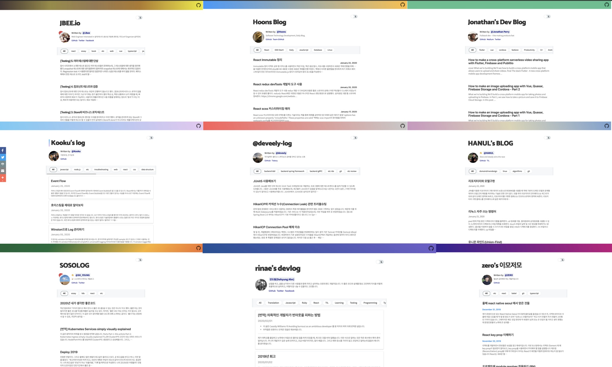

<div align="center">

  

</div>

[](https://opencollective.com/gatsby-starter-bee) [](https://greenkeeper.io/)
[](https://lgtm.com/projects/g/JaeYeopHan/gatsby-starter-bee/alerts/)
[](https://github.com/dwyl/esta/issues)
[](https://app.netlify.com/sites/gatsby-starter-bee/deploys)

<a href="https://twitter.com/JbeeLjyhanll">

</a>

[한국어🇰🇷](./README.ko.md)


In this template...

- 💄 Code highlight with Fira Code font
- 🧙 CLI Tool
- 😄 Emoji (emojione)
- 🗣 Social share feature (Twitter, Facebook)
- 💬 Comment feature (disqus, utterances)
- ☕ 'Buy me a coffee' service
- 🤖 GA
- ⭐ Enhance UX
- ⚙ Configurable

> [About this Template](https://www.gatsbyjs.org/starters/JaeYeopHan/gatsby-starter-bee/)

## Demo

- [Default Theme](https://gatsby-starter-bee.netlify.com/)

<details>
  <summary>Use case</summary>
  <p>
    
    <ul>
      <li>JBEE.io: https://jbee.io</li>
      <li>Rinae's devlog: https://rinae.dev/</li>
      <li>Seungdols Company: https://seungdols.dev/</li>
      <li>Kooku's log: https://kooku.netlify.com/</li>
      <li>SOSOLOG: https://so-so.dev/</li>
      <li>delivan.dev: https://delivan.dev/</li>
      <li>Jungin's blog: https://jungin.netlify.com/</li>
      <li>Zero's blog: https://awesomezero.com/</li>
      <li>Jonathan's blog: https://www.learningsomethingnew.com/</li>
      <li>@deveely-log: https://deveely-log.netlify.com/</li>
      <li>Hanul's blog: https://hanul-dev.netlify.com/</li>
      <li>Hoons Blog: https://hoons-up.netlify.com/</li>
      <li>JWN.cool: https://jwn.cool</li>
      <li>ugaemi's dev note: https://ugaemi.github.io</li>
      <li>Minsu's Dev Log: https://alstn2468.github.io/</li>
      <li>Yungi's Dev Blog: https://yungis.dev/</li>
      <li>< Taenylog />: https://taeny.dev/</li>
      <li>brouk's devlog: https://brouk-devlog.netlify.com/</li>
      <li>CoodingPenguin's Repository: https://cooding-penguin.netlify.com/</li>
      <li>Garima's Tech Blog: https://garimasingh.netlify.app/ </li>
      <li>DevRappers.dev: https://devrappers.dev/</li>
      <li>Let's doodle: https://duduling-blog.netlify.app/</li>
      <li>noopy.dev: https://noopy.dev/</li>
      <li>Hong_Devlog: https://hong-dev.github.io/</li>
      <li>samsara-ku's devlog: https://samsara-ku.dev/</li>
      <li>muse.kim: https://muse.kim/</li>
      <li>cereme.dev: https://cereme.dev</li>
      <li>taekki.dev: https://taekki.dev</li>
      <li>kkh913's Developer Blog: https://kkh913.github.io</li>
      <li>Merrily, Code: https://merrily-code.netlify.app/</li>
      <li>jeeneee's devlog: https://jeeneee.dev</li>
      <li>Noah's devlog: https://noah0316.github.io/</li>
      <li>bobs log: https://undefine.me</li>
      <li>irosyadi: https://irosyadi.netlify.app</li>
      <li>yujolog: https://yujo11.github.io/</li>
      <li>hexdrinker's devlog: https://hexdrinker.dev</li>
      <li>gparkki.io: https://gparkkii.github.io/</li>
      <li>BO.LOG: https://b5bo.github.io</li>
    </ul>
  </p>
</details>

> If you're using this template, Please Pull Request for `Use case`!

## 😎 Quick Start

### 1. Create a Gatsby site

```sh
# create a new Gatsby site using the blog starter
npx gatsby new my-blog-starter https://github.com/JaeYeopHan/gatsby-starter-bee
```

> If you are not using `npx`, following [Gatsby Getting Started](https://www.gatsbyjs.org/docs/quick-start)

```sh
npm install -g gatsby-cli
gatsby new my-blog-starter https://github.com/JaeYeopHan/gatsby-starter-bee
```

### 2. Start developing

```sh
cd my-blog-starter/
npm start
# open localhost:8000
```

### 3. Add your content

You can write...

- contents to blog in `content/blog` directory.
- resume `content/__about` directory.

> With markdown syntax and some meta data

#### Support script for creating new post


```sh
npm run post
```

👉 Use **gatsby-post-gen** (<https://github.com/JaeYeopHan/gatsby-post-gen>)

### 4. Fix meta data

You can fix meta data of blog in `/gatsby-meta-config.js` file.

### 5. Publish with [netlify](https://netlify.com)

[](https://app.netlify.com/start/deploy?repository=https://github.com/JaeYeopHab/gatsby-starter-bee)

:bulb: if you want to deploy github pages, add following script to package.json

```json
"scripts": {
    "deploy": "gatsby build && gh-pages -d public -b master -r 'git@github.com:${your github id}/${github page name}.github.io.git'"
}
```

## 🧐 Customize

### ⚙ Gatsby config

```sh
/root
├── gatsby-browser.js // font, polyfill, onClientRender ...
├── gatsby-config.js // Gatsby config
├── gatsby-meta-config.js // Template meta config
└── gatsby-node.js // Gatsby Node config
```

### ⛑ Structure

```sh
src
├── components // Just component with styling
├── layout // home, post layout
├── pages // routing except post: /(home), /about
├── styles
│   ├── code.scss
│   ├── dark-theme.scss
│   ├── light-theme.scss
│   └── variables.scss
└── templates
    ├── blog-post.js
    └── home.js
```

### 🎨 Style

You can customize color in `src/styles` directory.

```sh
src/styles
├── code.scss
├── dark-theme.scss
├── light-theme.scss
└── variables.scss
```

### 🍭 Tips (You can change...)

- Profile image! (replace file in `/content/assets/profile.png`)
- Favicon image! (replace file in `/content/assets/felog.png`)
- Header gradient! (\$theme-gradient `/styles/variables.scss`)
- Utterances repository! (replace repository address in `/gatsby-meta-config.js`)
  - ⚠️ Please check, this guide(<https://utteranc.es/>)

## ☕ Like it?

<a href="https://www.buymeacoffee.com/jbee" target="_blank">
  
</a>

## 🤔 If

If you are currently writing in the Medium, consider migration with [medium-to-own-blog](https://github.com/mathieudutour/medium-to-own-blog)!

## :bug: Bug reporting

[Issue](https://github.com/JaeYeopHan/gatsby-starter-bee/issues)

## 🎁 Contributing

[Contributing guide](./CONTRIBUTING.md)

## Contributors

### Code Contributors

This project exists thanks to all the people who contribute. [[Contribute](CONTRIBUTING.md)].

<a href="https://github.com/JaeYeopHan/gatsby-starter-bee/graphs/contributors">

</a>

### Financial Contributors

Become a financial contributor and help us sustain our community. [[Contribute](https://opencollective.com/gatsby-starter-bee/contribute)]

#### Individuals

<a href="https://opencollective.com/gatsby-starter-bee"></a>

#### Organizations

Support this project with your organization. Your logo will show up here with a link to your website. [[Contribute](https://opencollective.com/gatsby-starter-bee/contribute)]

<a href="https://opencollective.com/gatsby-starter-bee/organization/0/website"></a>
<a href="https://opencollective.com/gatsby-starter-bee/organization/1/website"></a>
<a href="https://opencollective.com/gatsby-starter-bee/organization/2/website"></a>
<a href="https://opencollective.com/gatsby-starter-bee/organization/3/website"></a>
<a href="https://opencollective.com/gatsby-starter-bee/organization/4/website"></a>
<a href="https://opencollective.com/gatsby-starter-bee/organization/5/website"></a>
<a href="https://opencollective.com/gatsby-starter-bee/organization/6/website"></a>
<a href="https://opencollective.com/gatsby-starter-bee/organization/7/website"></a>
<a href="https://opencollective.com/gatsby-starter-bee/organization/8/website"></a>
<a href="https://opencollective.com/gatsby-starter-bee/organization/9/website"></a>

## LICENSE

[MIT](./LICENSE)

<div align="center">

<sub><sup>Project by <a href="https://github.com/JaeYeopHan">@Jbee</a></sup></sub><small>✌</small>

</div>
