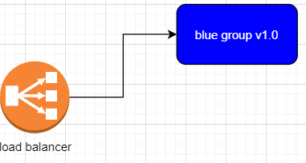
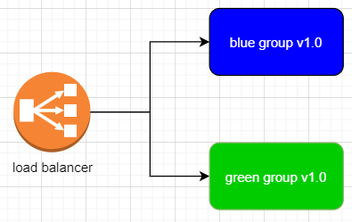
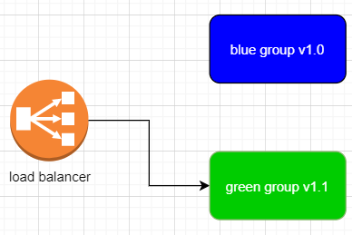
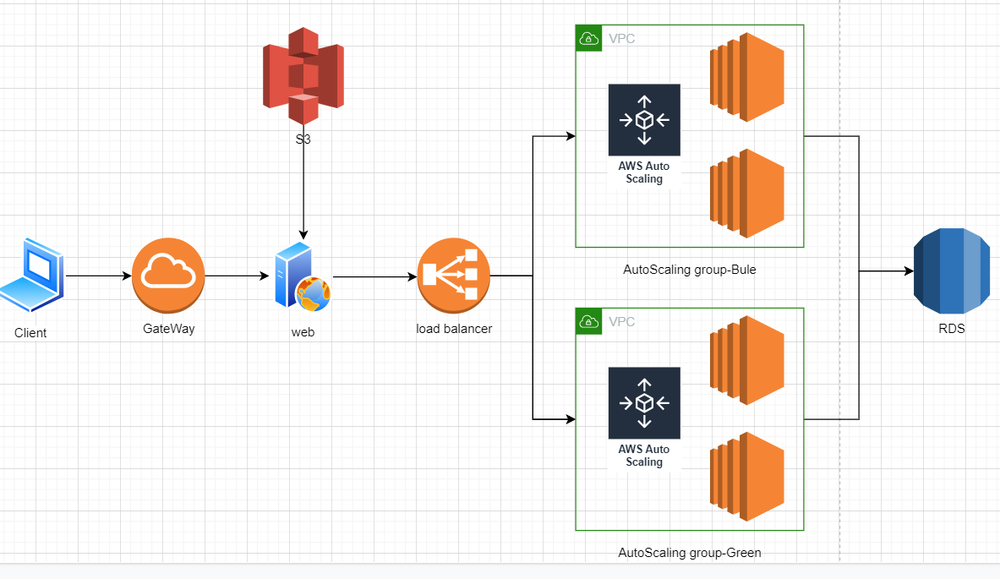

### Blue / Green 배포란?

어플리케이션을 서비스함에 있어 무중단은 굉장히 중요한 요소이다. blue / green 배포는 무중단 시스템 배포 방법중 가장 많이 사용하는 방법이다. 원리도, 만들기도 간단하다. 단점이 있다면, 배포할 어플리케이션과 동일한 인스턴스 그룹을 만들어야 하므로 비용 효율적이지는 않다. Aws를 활용하면 이를 간단히 구현 가능하다.

간단히 살펴보자. 아래 그림은 현재 상태이다.

만약 서비스 중인 어플리케이션을 업데이트 해야 한다면, 동일한 green 이라 불리는 새로운 AutoScaling Group 을 만들고 로드밸런서에 연결해준다. 

green 그룹에 업데이트를 적용하고기존에 있던 blue 그룹의 연결을 끊어준다. 작동중인 green 그룹에 로드밸런서가 할당되고 정지 없이 배포가 완료된다.

 

