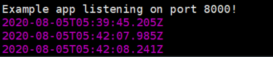
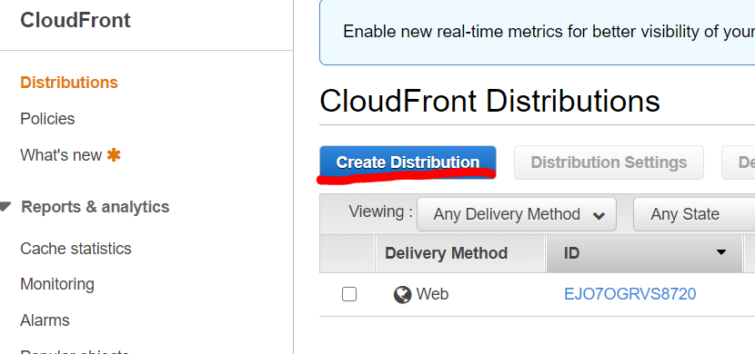
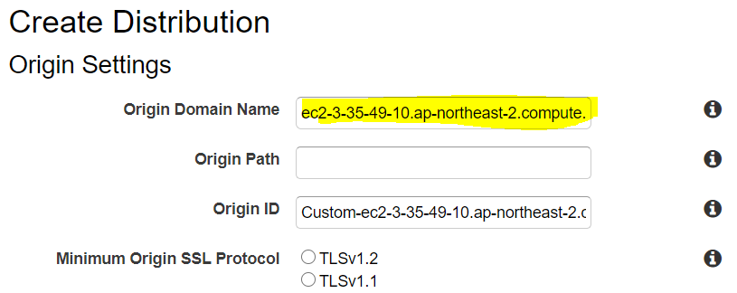
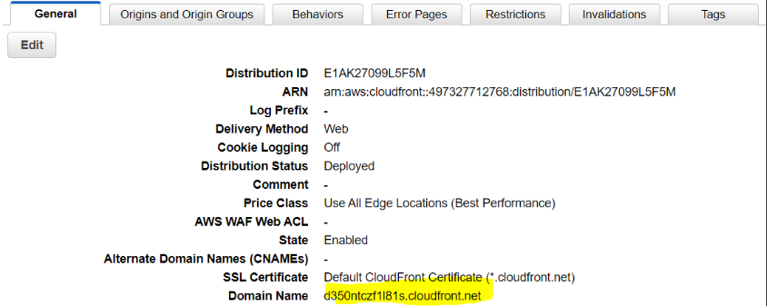
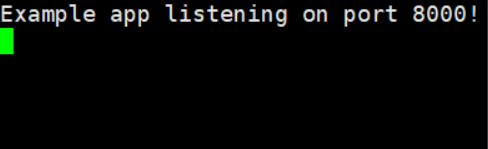
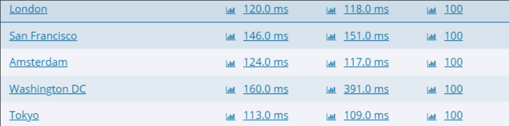

## CloudFront

아마존에서 제공하는 CDN(Contents Delibery Network)이다. 기능을 간단히 말하면, 캐시기능을 제공하여 웹페이지 불러오는데에 시간을 단축시켜준다. 추가적인 기능으로 Aws shield와 연동해 Ddos 공격을 막는 기능도 제공한다. 단점은, 동적인 데이터는 `CloudFront`에 저장해놓아도 정적인 데이터로 보여주기 때문에 정적데이터에 사용하기 알맞다.

`ec2`와 `client` 사이에 `CloudFront`를 추가하여 간단히 테스트해볼 예정이다.

### 개발환경

먼저 ec2 인스턴스가 linux 이미지로 실행하고 xshell로 ssh연결을 하였다. [여기](https://jeonghoon.netlify.app/Project/Aws/markdown/#ssh-접속)에서 확인할 수 있다. 또한 인스턴스 안에 node와 express가 깔려있어야 한다. 설치방법은 [여기]()에서 확인할 수 있다.

### 테스트

ec2 안에 아래와 같이 현재 시간을 웹과 인스턴스에 리턴하는 app.js 를 만들어 테스트 해주자. setTimeout으로 3초의 딜레이를 주었다.

```js
const express = require('express');
const app = express();
const port = process.env.PORT || 8000;

app.get('/', (req, res) => {
  setTimeout(function() {
    res.send("sleep all day : " + new Date());
    return console.log(new Date());
  }, 3000);
});
app.listen(port, () => console.log(`Example app listening on port ${port}!`));
```

먼저 초기화 시키고 pakage.json을 만든다. 기본 정보를 물을 때 엔터를 누르면 디폴트값으로 설정된다.

```shell
$ npm init
enter
enter
enter....
```

다음 명령어로 실행한다

```shell
$ node app.js
```

웹에서 8000포트로 인스턴스에 접속해보자.


ec2에서 다음과 같이 연결된 것도 확인할 수 있다.



<br/>

이제 CloudFront를 만들어서 테스트를 해볼 차례다. CloudFront 서비스를 선택하고 `create distribution` 을 눌러준다



<br/>

인스턴스의 DNS를 입력해주고 생성해준다. 나머지는 디폴트로 놔둬도 테스트에는 문제 없으니 그냥 놔두자.



<br/>

캐시서버의 도메인이름으로 접속해보면, 



시간이 변경되지 않고 그대로 저장되어 있음을 확인할 수 있다. 즉, 정적인 데이터로 보여준다.


새로고침해도 로그가 안생긴다.



https://www.dotcom-tools.com/ 에 가서 CloudFront 도메인 이름으로 `Website speed test`를 해보면, 3초 딜레이 없이 바로 실행되는 것을 확인할 수 있다.

