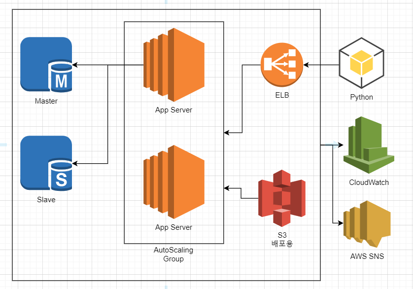

asdf

다음은 현재 완성할 아키텍처의 모습이다.

아래는 중고차 딜러샵의 API 명세서이다. 만들고보니 버리기 아까워서 그대로 넣어봤다. DB의 부하를 줄이기 위해 RDS의 slave에서 select만 처리하게, master에서 insert, update, delete를 처리하게 만들었다.

## Slave

슬레이브에서 select 구문을 처리해준다.

 

### Table : Customer 

고객 테이블

| Method | Member                 | Descriptions                                 |  Request   |     Response     |
| ------ | :--------------------- | :------------------------------------------- | :--------: | :--------------: |
| Get    | /Customer/select       | 전체 고객 데이터 출력                        |     X      | 전체 고객 데이터 |
| Get    | /Customer/select/name  | 고객 이름으로 검색해서 출력                  | cust_name  |   요청한 고객    |
| Get    | /Customer/select/id    | 고객 ID로 검색해서 출력                      |  cust_id   |   요청한 고객    |
| Get    | /Customer/select/phone | 고객 전화번호 검색해서 출력(중복처리를 위해) | cust_phone |   요청한 고객    |

 

### Table : Car

자동차 테이블

| Method | Member           | Descriptions                  | Request  |      Response      |
| ------ | :--------------- | :---------------------------- | :------: | :----------------: |
| Get    | /Car/select      | 전체 자동차 데이터 출력       |    X     | 전체 자동차 데이터 |
| Get    | /Car/select/id   | 자동차 ID로 검색해서 출력     |  car_id  |   요청한 자동차    |
| Get    | /Car/select/name | 자동차 이름으로 검색해서 출력 | car_name |   요청한 자동차    |

 

### Table : Sales_invoice

판매목록 저장 테이블

| Method | Member                   | Descriptions                                             | Request |       Response       |
| ------ | :----------------------- | :------------------------------------------------------- | :-----: | :------------------: |
| Get    | /Sales_invoice/select    | 전체 판매목록 데이터 출력                                |    X    | 전체 판매목록 데이터 |
| Get    | /Sales_invoice/select/id | 판매목록 중 자동차ID로 출력(판매된 자동차인지 확이 위해) | car_id  |    요청한 자동차     |

 

### Table : mechanics

정비공 테이블

| Method | Member                 | Descriptions                          |    Request    |      Response      |
| ------ | :--------------------- | :------------------------------------ | :-----------: | :----------------: |
| Get    | /mechanics/select      | 전체 정비공 데이터 출력               |       X       | 전체 정비공 데이터 |
| Get    | /mechanics/select/name | 정비공 이름으로 출력(예약처리를 위해) | mechanic_name |   요청한 정비공    |

 

 

## Master

마스터에서 Insert, Update, Delete를 처리한다

 

### Table : Customer 

고객 테이블

| Method | Member           | Descriptions                                                 |                    Request                    | Response |
| ------ | :--------------- | :----------------------------------------------------------- | :-------------------------------------------: | :------: |
| Post   | /Customer/insert | 추가할 고객의 이름, 전화번호, 생년월일 추가                  |     cust\_name, cust\_phone, cust\_birth      | Complete |
| Post   | /Customer/update | 고객 ID로 검색해서 요청한 고객의 이름, 전화번호 생년월일 변경 | cust\_name, cust\_phone, cust\_birth, cust_id | Complete |
| Delete | /Customer/delete | 고객 ID로 삭제                                               |                    cust_id                    | Complete |

 

### Table : Car

자동차 테이블

| Method | Member            | Descriptions                                                 |              Request               | Response |
| ------ | :---------------- | :----------------------------------------------------------- | :--------------------------------: | :------: |
| Post   | /Car/insert       | 추가할 자동차 자동차명, 색, 제조국가 추가                    |     car\_name, color, made\_by     | Complete |
| Post   | /Car/update       | 자동차 ID로 검색해서 요청한 자동차의 자동차명, 색상, 제조국가 변경 | car\_name, color, made\_by, car_id | Complete |
| Post   | /Car/update/sales | 자동차가 판매되면 판매상태를 'sold out'으로 변경             |               car_id               | Complete |
| Delete | /Car/delete       | 자동차 ID로 삭제                                             |               car_id               | Complete |

 

### Table : Sales_invoice

판매목록 테이블

| Method | Member                | Descriptions                                         |           Request            | Response |
| ------ | :-------------------- | :--------------------------------------------------- | :--------------------------: | :------: |
| Post   | /Sales_invoice/insert | 고객 ID, 판매원 ID, 자동차 ID를 판매번호를 붙여 추가 | cust\_id, sales\_id, car_id, | Complete |

 

### Table : mechanics

정비공 테이블

| Method | Member            | Descriptions                                              |      Request       | Response |
| ------ | :---------------- | :-------------------------------------------------------- | :----------------: | :------: |
| Post   | /mechanics/update | 요청한 요일에 요청한 정비공이 예약되면 'reserved' 로 변경 | day, mechanic_name | Complete |