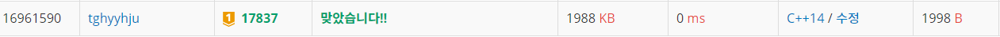

자세한 문제는 [새로운게임2 17837](https://www.acmicpc.net/problem/17837)를 참고하자.
<br/><br/><br/><br/>

방심하면 안 되는 문제였다. 나는 다음과 같이 풀이했다.

먼저 사용할 변수를 설정한다. 맵을 저장할 arr, 말을 저장할 horse, 맵에 horse의 인덱스를 저장할 ground벡터를 만들었다. horse의 두번째 인자 0~3은 각각 0 = r(행), 1 = c(열), 2 = d(방향), 3 = 위치하는 칸에서 몇번째 인덱스인지를 가르킨다.

```c
int n, k; // n = 맵 크기, k = 말 갯수
int arr[12][12], horse[10][4]; // 맵 저장, 말 저장
int dr[4] = { 0,0,-1,1 }; // r과 c의 방향이 될 dr, dc
int dc[4] = { 1,-1,0,0 };
vector<int> ground[12][12]; // 말의 인덱스 저장
```

<br/>

문제의 조건을 입력한다. 나는 배열의 첫번째 행과 열이 비는 것을 좋아하지 않아서 조건들을 1씩 줄였다.

```c
cin >> n >> k;
//맵 저장
for (int i = 0; i < n; ++i)
    for (int j = 0; j < n; ++j)
        cin >> arr[i][j];
//말 저장
for (int i = 0; i < k; ++i) {
    cin >> horse[i][0] >> horse[i][1] >> horse[i][2];
    horse[i][0]--; horse[i][1]--; horse[i][2]--; horse[i][3] = 0;
    ground[horse[i][0]][horse[i][1]].push_back(i);
}
```

<br/>

1000 이상이 되면 멈출 while문을 작성해준다. ground의 현재 칸에서 말의 순서(인덱스)를 h-index로, 현재 칸의 크기를 last-index로 정하였다. last-index(현재칸 크기) - h-index(말의 순서) = ''이동 시켜야할 횟수'' 를 구할 수 있다.

```c
int cnt = 0; // 카운트
bool check = false;
while (cnt < 1000) {
    cnt++;
    // i = 말의 인덱스로, 말들을 순서대로 이동시킴
    for (int i = 0; i < k; ++i) {
        int r = horse[i][0];
        int c = horse[i][1];
        int h_index = horse[i][3]; // 현재 말이 들어있는 칸에서 말이 몇번째 순서(인덱스)인지
        int last_index = ground[r][c].size(); //현재 말이 들어있는 칸의 크기
        int nr = r + dr[horse[i][2]]; // 다음 r칸
        int nc = c + dc[horse[i][2]]; // 다음 c칸
```

<br/>

먼저 다음 칸이 어떤 색인지 탐색을 해준다. 파랑이거나 말판을 벗어나면 방향을 바꾼다

```c
//파랑이거나 말판을 벗어나면 방향을 바꿔준다
        if (nr < 0 || nc < 0 || nr >= n || nc >= n || arr[nr][nc] == 2) {
            if (horse[i][2]	 < 2)horse[i][2] = (horse[i][2] + 1) % 2; // 0,1을 서로 바꿈
            else horse[i][2] = (horse[i][2] + 1) % 2 + 2; // 2,3을 서로 바꿈
            nr = r + dr[horse[i][2]]; // horse에 현재 말의 위치를 갱신해준다.
            nc = c + dc[horse[i][2]];
        }
```

<br/>

그리고 이동을 구현한다. 파랑이면 움직이지 않는다. 

다음 칸이 빨강(1)이면 다음칸에 역순으로 저장한다. 현재칸의 마지막값을 벡터.back()으로 구하고 다음 칸에 저장, 현재 칸의 마지막 값은 버린다. 말의 행(r)과 열(c), 자신이 있는 칸에서 몇번째 순서인지 horse 배열에 갱신해준다.

```c
		//그 다음 파랑이면 움직이지 않는다.
        if (nr < 0 || nc < 0 || nr >= n || nc >= n || arr[nr][nc] == 2) continue;
        //빨강이면 현재 칸의 말들을 다음 칸에 역순으로 옮긴다.
        if (arr[nr][nc] == 1) {
            for (int j = h_index; j < last_index; ++j) {
                ground[nr][nc].push_back(ground[r][c].back());
                horse[ground[r][c].back()][3] = ground[nr][nc].size() - 1;
                horse[ground[r][c].back()][0] = nr; horse[ground[r][c].back()][1] = nc;
                ground[r][c].pop_back();
            }
        }
```


다음 칸이 하양(0)이면 다음칸에 순서대로 저장한다. 역시 행과 열, 몇번째인지 갱신한다. 그리고 한 칸에 말의 갯수가 4개 이상이면 while문을 빠져나온다.

```c
        //흰색이면 현재 칸의 말들을 다음 칸에 순서대로 저장한다.
        else if (arr[nr][nc] == 0) {
            for (int j = h_index; j < last_index; ++j) {
                ground[nr][nc].push_back(ground[r][c][j]);
                horse[ground[r][c][j]][3] = ground[nr][nc].size() - 1;
                horse[ground[r][c][j]][0] = nr; horse[ground[r][c][j]][1] = nc;
            }
            for (int j = h_index; j < last_index; ++j)
                ground[r][c].pop_back();
        }
		//크기가 4이상이면 while문을 종료한다.
        if (ground[nr][nc].size() >= 4) {
            check = true;
            break;
        }
    }
    if (check == true)break;
```

다음과 같은 결과를 얻을 수 있다.



<br/><br/><br/><br/>풀소스

```c
//백준 17837 새로운게임2
//keypoint : 구현, 스택 활용
#include <iostream>
#include <vector>
using namespace std;

int n, k;
int arr[12][12], horse[10][4];
int dr[4] = { 0,0,-1,1 };
int dc[4] = { 1,-1,0,0 };
vector<int> ground[12][12];

int main() {
	ios_base::sync_with_stdio(false);
	cin.tie(NULL);
	cout.tie(NULL);
    //문제 조건 입력
	cin >> n >> k;
	for (int i = 0; i < n; ++i)
		for (int j = 0; j < n; ++j)
			cin >> arr[i][j];
	for (int i = 0; i < k; ++i) {
		cin >> horse[i][0] >> horse[i][1] >> horse[i][2];
		horse[i][0]--; horse[i][1]--; horse[i][2]--; horse[i][3] = 0;
		ground[horse[i][0]][horse[i][1]].push_back(i);
	}
    
    //시작
	int cnt = 0;
	bool check = false;
	while (cnt < 1000) {
		cnt++;
		for (int i = 0; i < k; ++i) {
			int r = horse[i][0];
			int c = horse[i][1];
			int h_index = horse[i][3];
			int last_index = ground[r][c].size();
			int nr = r + dr[horse[i][2]];
			int nc = c + dc[horse[i][2]];

			if (nr < 0 || nc < 0 || nr >= n || nc >= n || arr[nr][nc] == 2) {
				//파랑화, 방향 전환
				if (horse[i][2]	 < 2)horse[i][2] = (horse[i][2] + 1) % 2;
				else horse[i][2] = (horse[i][2] + 1) % 2 + 2;
				nr = r + dr[horse[i][2]];
				nc = c + dc[horse[i][2]];
			}
			//그 다음 파랑이면 안 움직임
			if (nr < 0 || nc < 0 || nr >= n || nc >= n || arr[nr][nc] == 2) continue;
			//빨강, 1
			if (arr[nr][nc] == 1) {
				for (int j = h_index; j < last_index; ++j) {
					ground[nr][nc].push_back(ground[r][c].back());
					horse[ground[r][c].back()][3] = ground[nr][nc].size() - 1;
					horse[ground[r][c].back()][0] = nr; horse[ground[r][c].back()][1] = nc;
					ground[r][c].pop_back();
				}
			}
			//흰색, 0
			else if (arr[nr][nc] == 0) {
				for (int j = h_index; j < last_index; ++j) {
					ground[nr][nc].push_back(ground[r][c][j]);
					horse[ground[r][c][j]][3] = ground[nr][nc].size() - 1;
					horse[ground[r][c][j]][0] = nr; horse[ground[r][c][j]][1] = nc;
				}
				for (int j = h_index; j < last_index; ++j)
					ground[r][c].pop_back();
			}
			if (ground[nr][nc].size() >= 4) {
				check = true;
				break;
			}
		}
		if (check == true)break;
		
	}
	if (cnt == 1000)cout << -1;
	else cout << cnt;
	return 0;
}
```

