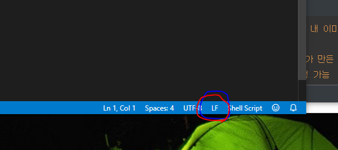
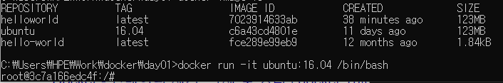
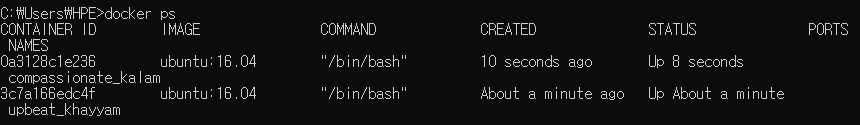

## Docker

cpu의 가상화 기술 이용방식

<br/>

#### 저장방식

유니온 파일 시스템을 이용 > 여러 개의 Layer를 하나의 파일시스템으로 사용 가능하다.

(layer낭비를 막을 수 있다. -> 메모리가 절약된다.)

<br/>

#### docker image

컨테이너 실행에 필요한 파일과 설정 값 등을 포함 -> 상태값 x,immutable

대신 실체화 -> Container

<br/>

<br/>

<br/>

## 설치

[hub.docker.com](https://hub.docker.com/editions/community/docker-ce-desktop-windows)에 가서 `Docker Desktop for Windows` 를 다운로드 받자

(윈도10이고 pro, enterprise ver,64bit만 가능하다)

<br/>


docker디렉토리와 하위에 day01 디렉토리를 만들자

이제 vscode에서 dockerfile, helloworld(image)를 만들자

```bash
# helloworld에는 얘
#!bin/sh

echo "Hello, World!"
----------------------
# dockerfile에는 얘를 넣자
FROM ubuntu:16.04

COPY helloworld /usr/local/bin
RUN chmod +x /usr/local/bin/helloworld
CMD ["helloworld"]
```

<br/>

vscode를 쓴다면,



우측 하단을 LF로 바꿔주고 저장해야한다.

안 그러면 밑의 작업 도중에 다음과 같은 에러를 만날 수 있다.

```
standard_init_linux.go:211: exec user process caused "no such file or directory
```


<br/>

<br/>

이제 잘 작동하는지 확인해보자

```bash
$ docker image build -t helloworld:latest . # 내 이미지에 태그 달아줌
$ docker image ls # 이미지들 확인 가능
$ docker container run helloworld:latest # 내가 만든 helloworld 이미지 실행
$ docker run helloworld:latest # 이제 계속 실행 가능
$ docker container run hello-world # 새로 만들어줌
$ docker run hello-world # 실행, 
```

<br/>

ubuntu image가 있다면,

```bash
$ docker run -it ubuntu:16.04 /bin/bash # ubuntu image가 있다면 실행함
```

<br/>



다음과 같이 실행할 수 있다. 현재 rinux ubuntu 실행중



새 cmd창에서 ubuntu 2개가 실행중인 것을 확인할 수 있다. 매우 쉽게 확장 가능하다


---

### docker file 삭제

만약 docker파일을 지우려면, 컨테이너 먼저 지워야하고 실행중인 것을 stop를 해야 한다.

```bash
$ docker ps -a # 파일들을 보고
$ docker stop [id]
$ docker rm [id] # 하면 지울 수 있다
```

---

### 이미지 내려받기

```bash
$ docker image pull gihyodocker/echo:latest
$ docker run -t -p 9000:8080 gihyodocker/echo:latest # 받은 이미지 실행
```

<br/>

이제 웹에서 localhost:9000으로 접속하면 실행되는 화면을 볼 수 있다.

해당 이미지는 웹서버에 띄워주는 에코서버 이미지이다.