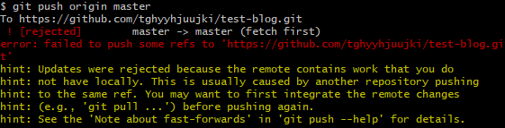
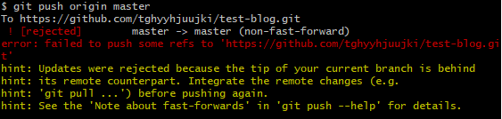
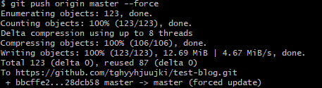

### 문제 : git push origin master시 문제 발생



! [rejected]        master -> master (fetch first) 라는 에러가 뜬다. fetch를 먼저 해준다.

```shell
$ git fetch
```

<br/>

다시 git push origin master를 해보면 



master -> master(non-fast-forward)라는 에러가 발생하였다. 찾아본 결과 공통분모가 없는 repository를 병합하려는게 문제라고 한다(분명 하나의 repo에서 clone을 만들어서 문제가 없을텐데.. 찾아봐야할 거 같다).

<br/>

### 해결방법

```shell
# 강제로 push할 수도 있지만 불안하므로
$ git push origin master --force

#아래와 같이 작성해준다
$ git pull origin master --allow-unrelated-histories
```

난 강제로 올렸는데 되길래 그냥 사용중이다.

