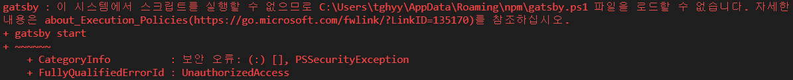
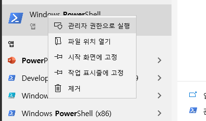
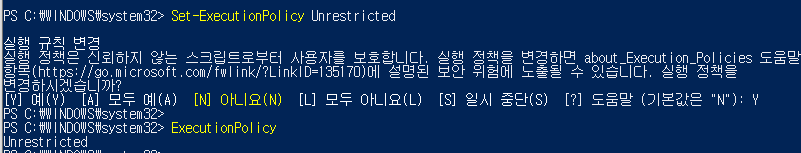

VScode에서 PowerShell로 작업하다보면 다음과 같은 에러를 종종 본다.



VScode에서 실행권한이 없으므로 실행 규칙을 변경해줘야 한다.

먼저 PowerShell을 관리자 권한으로 실한한 뒤



아래 명령어로 권한을 해제하면 된다.

```powershell
$ Set-ExecutionPolicy Unrestricted # 권한 설정
$ ExecutionPolicy # 설정된 권한 확인
```




`Unrestricted` 가 뜨면 정상적으로 해제된 것이다.