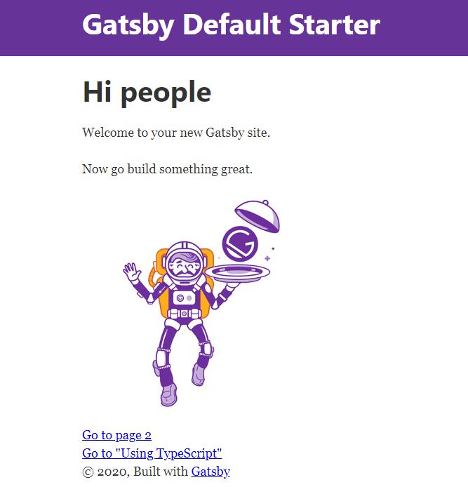

## Gatsby란?

배포와 동시에 정적페이지를 만들기 때문에 웹서버가 필요없는 node.js에서 파생된 프레임워크

## 1. 환경설정

현재 내 개발환경은 Windows10 이며 코드편집기로 VScode를 사용한다.

다음은 설치할 목록

```
1. git bash
2. node
3. gatsby
```

### git bash

https://gitforwindows.org/

### node 설치

https://nodejs.org/en/

위 링크에서`node.js`를 설치해주고 잘 설치 되었는지 아래와 같이 powershell에서 버전을 확인해준다.

```powershell
PS C:\Users\A0501660> node --version
v12.18.2
```

<br/>

### Gatsby 설치

gatsby를 설치해준다. `-g`는 global 옵션으로 설치된 패키지를 전역에서 참조할 수 있게 만들어준다. 전역으로 설치한 경우, Windows 는 아래 경로에서 확인 가능하다. 

c:\Users\%USERNAME%\AppData\Roaming\npm\node_modules 

```powershell
$ npm install -g gatsby-cli
```

<br/>

## 2. 프로젝트 생성하기

세 가지 방법으로 블로그를 시작할 수 있다.

### default 블로그 생성하기

다음과 같이 간단하게 만들 수 있다.

```powershell
$ gatsby new [만들 디렉토리 이름]
```

<br/>

### 	Gatsby 스타터팩으로 시작하기

https://www.gatsbyjs.com/starters/

위 링크에서 본인이 원하는 블로그 또는 정적사이트 스타터팩을 골라 빠르게 시작할 수 있다.

원하는 팩을 골랐다면, 아래 명령어로 프로젝트를 만들어준다. 설치 명령어는 팩 안에 적혀있다.

```powershell
$ gatsby new [만들 디렉토리 이름] [git 주소]

# 예시, 가장 대표적인 gatsby 스타터팩
$ gatsby new gatsby-starter-blog https://github.com/gatsbyjs/gatsby-starter-blog 
```

<br/>

### github에서 clone 해서 시작하기

```powershell
$ git clone [Gatsby 있는 git adress]
```

<br/>

## 3. 실행

만들어진 디렉토리 경로에서 아래 명령어를 실행해 빌드해준다. 

```powershell
$ gatsby develop
```

아래와 같이 에러가 뜬다면,


설명대로 npm install을 해주면 된다. 디펜던시의 모듈들을 먼저 설치해줘야하기 때문에 생긴 에러이다.

```powershell
$ npm install
```

명령어를 실행하면 package.json에 있는 디펜던시의 모듈들을 설치한다.


그러면 아래와 같은 디렉토리와 모듈들이 생성된다.


만약 아래와 같은 에러가 떴다면,


VScode 에서 권한문제이므로, [VScode PowerShell 에러](https://jeonghoon.netlify.app/Etc/powershell_error/)에서 확인하자

<br/>


위와 같은 명령어들을 사용할 수 있는데, gatsby develop 명령어로 개발모드로 실행해 로컬에서 잘 돌아가는지 확인해주자.

```powershell
$ gatsby develop # 개발모드 진입
$ gatsby develop -H 0.0.0.0 # 원하는 ip 및 포트 설정 가능
```

디폴트로 실행했다면 http://localhost:8000/ 에서 본인의 블로그를 확인할 수 있다.

### default

default 블로그를 만들 경우 아래와 같이 나온다.




### 이미 만들어진 블로그

git에서 clone 했을 경우 또는 만들어진 스타터를 사용했을 경우 당연하지만 구성된 화면이 나온다.


<br/>

참고로 Gatsby는 핫 리로딩이 되게 때문에 블로그 업데이트를 반영하는 즉시 웹에서 확인이 가능하다.