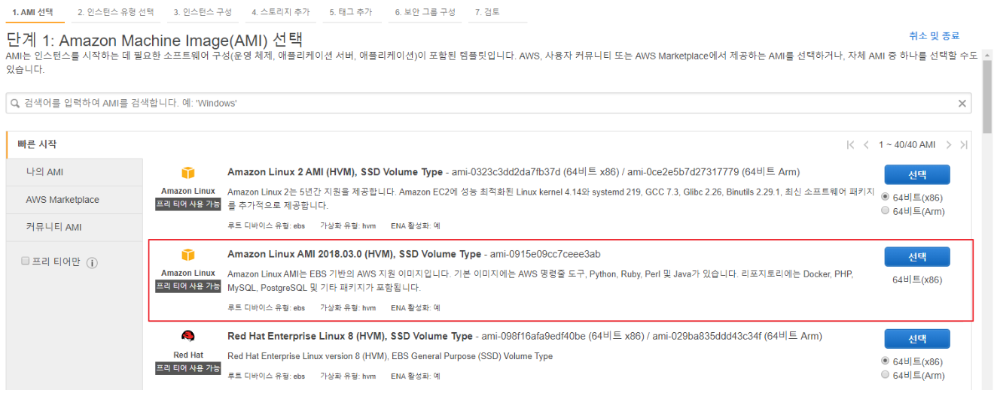
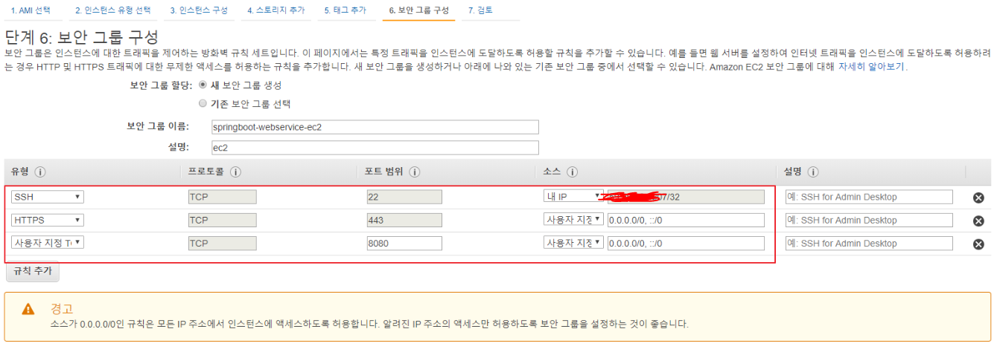
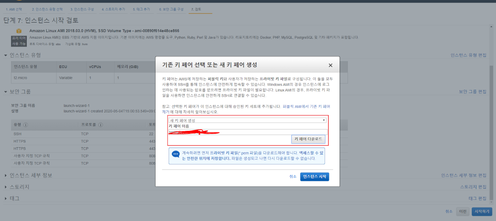
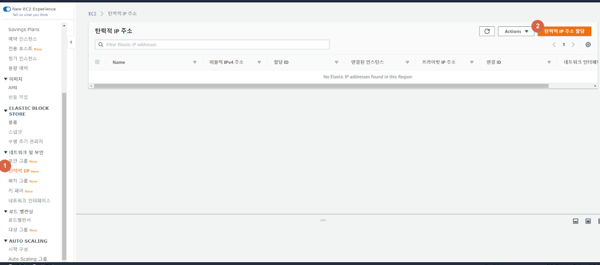
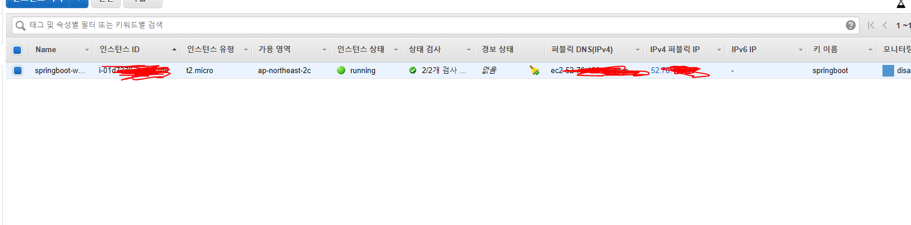
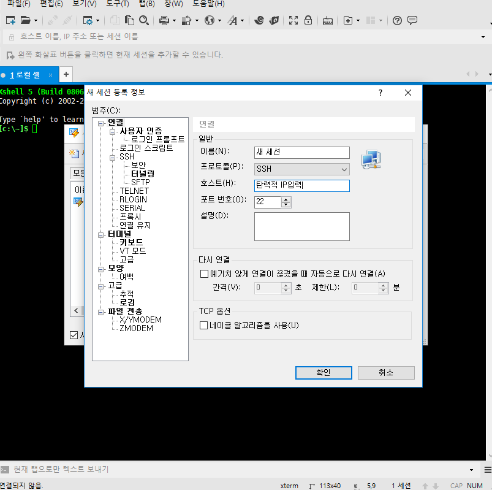
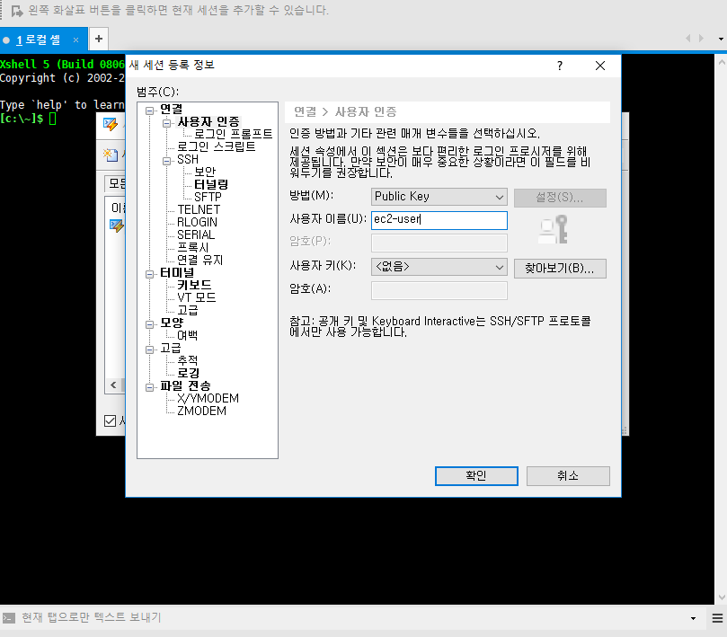
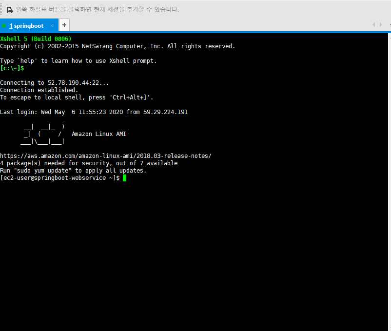

로컬에서만 작동하는 Springboot 프로젝트를 Aws의 EC2의 DB로 어디서든 접속 가능하게 만들 것이다.

먼저 Aws의 EC2 인스턴스를 만들어준다.

중요한 것만 설명하자면,

리눅스를 선택하고,

 

ssh, https, 8080포트를 보안그룹으로 추가해주고,

 

마지막으로 키페어를 생성해준다. 나중에 ssh로 접속할 때 사용할 공개키이다.

 

이제 Aws에서 탄력적IP를 할당받아 내 인스턴스가 어디서든 접속 가능하게 만들어준다

알맞게 환경설정 해주고

인스턴스 목록을 확인해보면 할당받은 탄력적 IP가 잘 들어가있으면 성공이다.

---

## SSH 접속

이제 내 인스턴스에 접속해본다.

예전에는 putty로 접속했지만, Xshell을 사용해보니 너무 편해서 이것을 사용해보려한다.

기업에서는 유료지만 공부목적으로 무료로 사용 가능하다. 

[https://www.netsarang.com/ko/xshell/](https://www.netsarang.com/ko/xshell/)

실행시키고 새 세션 등록을 열어서

호스트에 위에서 설정한 인스턴스의 탄력적 IP를 입력한다

 

사용자인증 탭에서 public key로 설정하고 사용자 이름을 ec2-user로 입력한다

그리고 인스턴스 생성시 만들었던 공개키를  넣어주고 연결하면

 

접속이 되면 성공한 것이다.