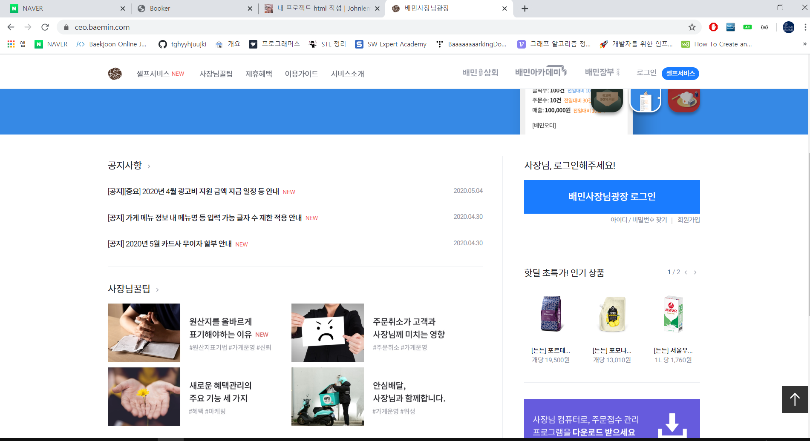
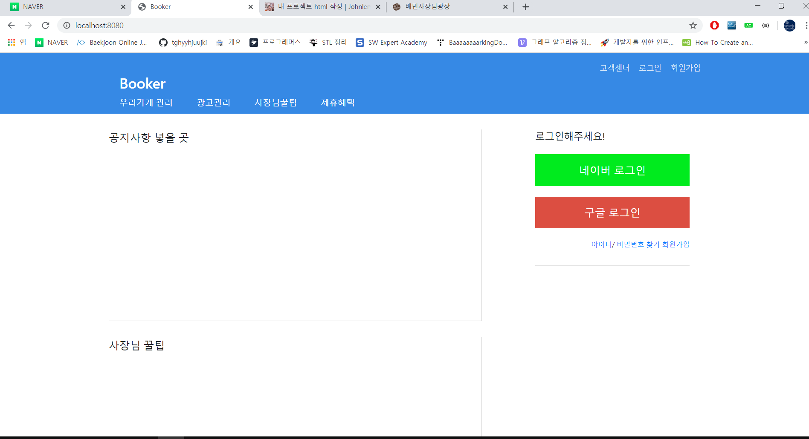
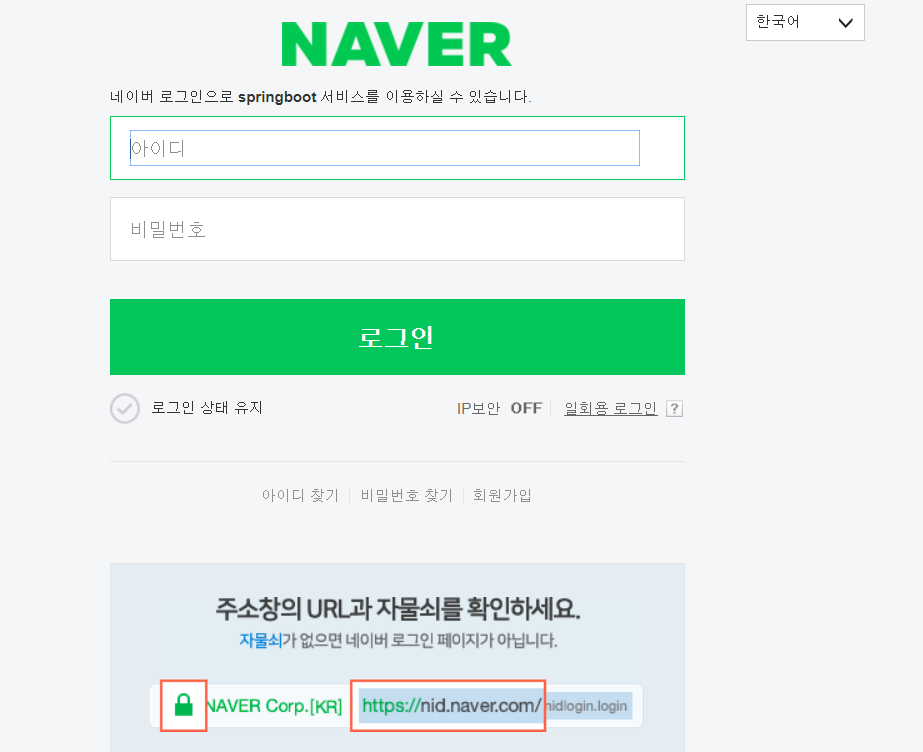

갑자기 코로나 사태가 잠잠해지면서 그 동안 못했던 것들을 몰아서 하느라 너무 정신이 없다

rinux, docker, openstack, html, react, spring, aws, gatsby 등 블로그에 쓸 것들은 많이 쌓여있는데 언제 다 정리해서 올리지...

일단 오늘은 현재 진행중인 프로젝트의 Html 프로토타입을 준비해봤다.

프로젝트에 대한 자세한 설명은 다른곳에 포스팅할 예정이다

<br/><br/>

프로토타입은 Html연습할 겸 배달의민족 사장님사이트 디자인을 카피하기로했다



<br/>

일단 Springboot에서 mustache로 구성을 했다

mustache를 사용하려면 다음과 같이 설정해준다.

/springboot/build.gradle 파일에서

```properties
compile 'org.springframework.boot:spring-boot-starter-mustache'
```

<br/>

refresh 해서 적용시키고, header와 footer를 만들어준다

/springboot/src/main/resources/templates/layout/header.mustache

```html
<!DOCTYPE html>
<html>
<head>
	<title>Booker</title>
    <link rel="stylesheet" href="/css/reset.css">
    <link rel="stylesheet" href="/css/style.css">
	<meta http-equip="Content-Type" content="text/html; charset=UTF-8" />
	<link rel="stylesheet" href="https://stackpath.bootstrapcdn.com/bootstrap/4.4.1/css/bootstrap.min.css">
</head>
<body>
<!-- header 디자인 넣으면 된다 -->
```

여기서 주의할 것은 css파일은 resource디렉토리 밑에 놔야한다.  resource가 경로의 루트가 되기 때문이다.

<br/>

/springboot/src/main/resources/templates/layout/footer.mustache

```html
	<!-- footer 디자인 넣으면 된다 -->
	<script src="https://code.jquery.com/jquery-3.4.1.min.js"></script>
	<script src="https://stackpath.bootstrapcdn.com/bootstrap/4.4.1/js/bootstrap.min.js"></script>
	<script src="/js/app/index.js"></script>
</body>
</html>

```

footer에는 버튼 등의 활성화 기능을 사용할 index파일, bootstrap, jquery를 연결해준다.

<br/>

/springboot/src/main/resources/templates/index.mustache

```html
{{>layout/header}}
	
<!-- 여기에 바디 내용 쓰면 된다-->
	
{{>layout/footer}}
```

header와 footer를 연결해줄 수 있다. 쓰면 쓸수록 mustache는 엄청 편리한거 같다.

<br/>

이제 로컬에서 확인해보면,



내용이 없어 많이 심플하다

이제 새로운 페이지를 작성할 때마다 header와 footer는 생략해도 된다.

<br/>




네이버랑 구글은 구글 클라우드서비스를 이용하여 Oauth2를 사용해 연동해놓긴 했는데 다음에 포스팅하겠다.

