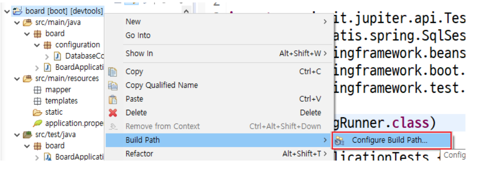
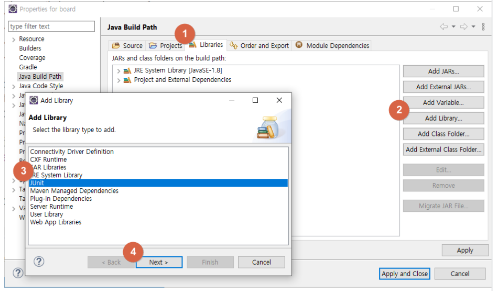
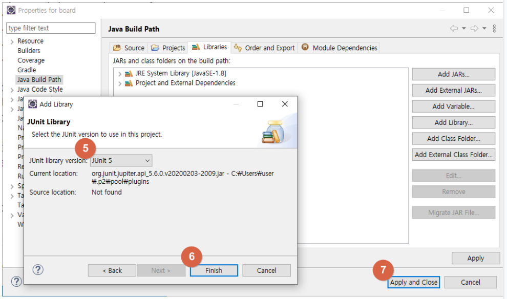
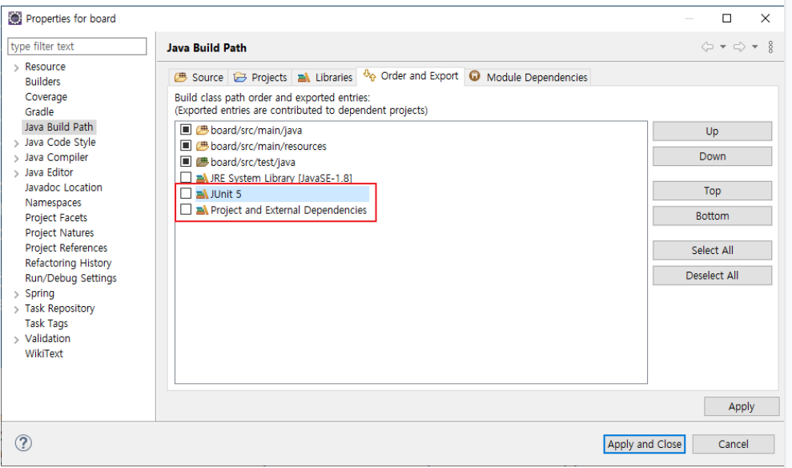
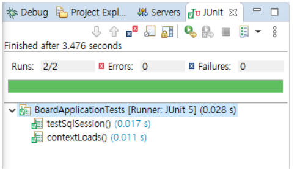

/board/src/test/java/board/BoardApplicationTests.java 자바파일에 다음 내용 작성

```java
package board;

import org.junit.jupiter.api.Test;
import org.junit.runner.RunWith;
import org.mybatis.spring.SqlSessionTemplate;
import org.springframework.beans.factory.annotation.Autowired;
import org.springframework.boot.test.context.SpringBootTest;
import org.springframework.test.context.junit4.SpringRunner;

@RunWith(SpringRunner.class)
@SpringBootTest
class BoardApplicationTests {

	@Autowired
	private SqlSessionTemplate sqlSessionTemplate;
	
	@Test
	void contextLoads() {
	}

	@Test
	public void testSqlSession() throws Exception {
		System.out.println(sqlSessionTemplate.toString());
	}
}
```

<br/>

### 빌드 패스에 JUnit 라이브러리 추가







<br/>

여기서 Junit5 관련 오류가 발생하면 해당 프로젝트의 Configuration build path에서 

Junit5를 위로 한칸 올려준다



<br/>

JUnit 테스트 2개 모두 통과했다는 것은 sqlSessionTemplate을 생성했다는 의미

