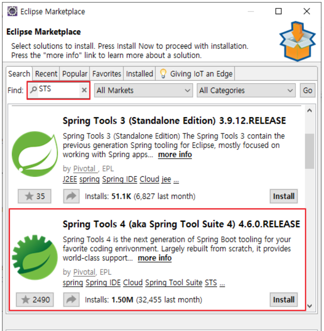
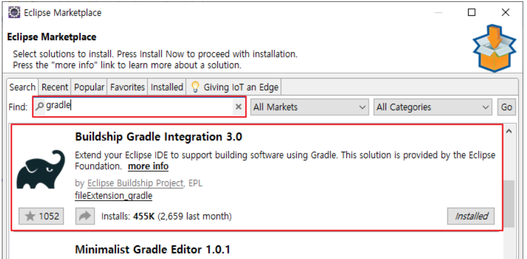
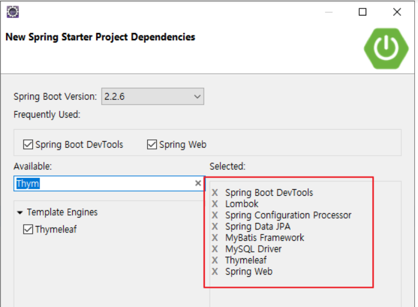
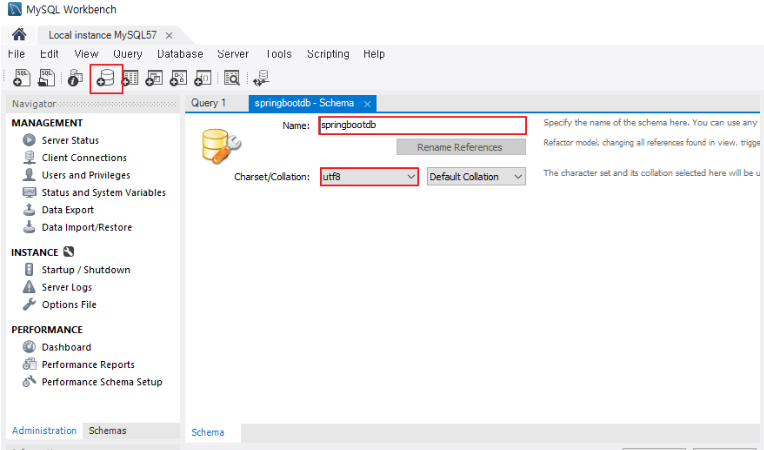
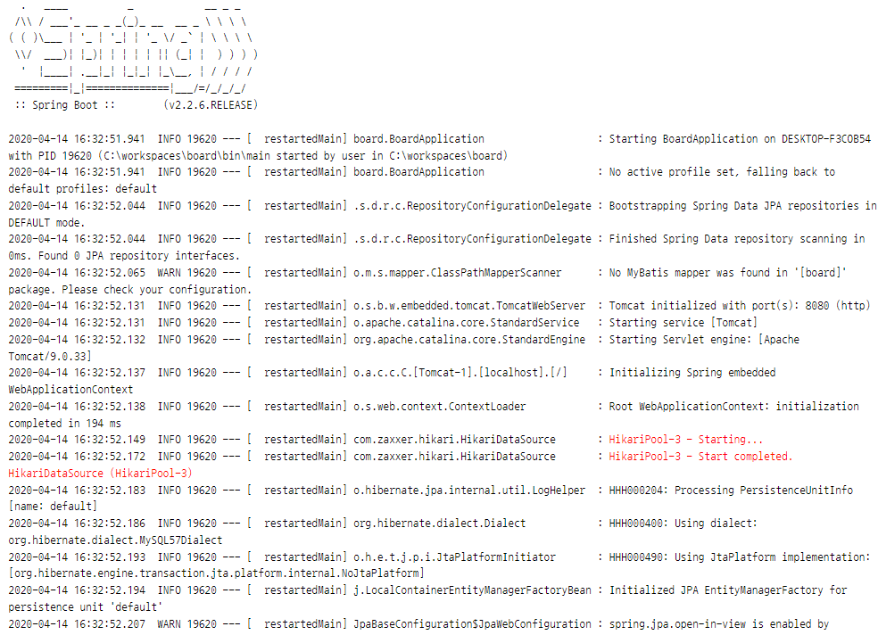
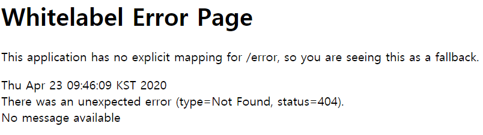

## 환경설정

Eclipse Marketplace에서 STS플러그인 설치

* STS(Spring Tool Suite) 스프링 애플리케이션 개발을 위한 이클립스 기반의 개발 환경




<br/>

Gradle 설치



<br/>

[Workbench](https://dev.mysql.com/downloads/workbench/)설치 

---

### Spring boot 프로젝트 생성

board이름의 프로젝트를 만들고

다음과 같은 8개의 의존성을 추가해준다



<br/>

### Workbench에서 DB생성



<br/>

/board/src/main/resources/application.properties 경로의 설정파일에 다음 내용을 추가하여 DB연결

```properties
spring.datasource.hikari.driver-class-name=com.mysql.cj.jdbc.Driver
spring.datasource.hikari.jdbc-url=jdbc:mysql://localhost:3306/springbootdb?useUnicode=true&characterEncoding=utf-8&serverTimezone=Asia/Seoul
spring.datasource.hikari.username=본인 mysql 아이디
spring.datasource.hikari.password=본인 mysql 비밀번호
spring.datasource.hikari.connection-test-query=select 1
```

<br/>

/board/src/main/java/board/configuration/DatabaseConfiguration.java파일을 만들고 다음 내용을 추가

```java
package board.configuration;

import javax.sql.DataSource;

import org.springframework.boot.context.properties.ConfigurationProperties;
import org.springframework.context.annotation.Bean;
import org.springframework.context.annotation.Configuration;
import org.springframework.context.annotation.PropertySource;

import com.zaxxer.hikari.HikariConfig;
import com.zaxxer.hikari.HikariDataSource;

//@Configuration : 클래스에 이 어노테이션이 붙어 있으면 스프링은 해당 클래스를 Java config로 간주한다.
@Configuration
@PropertySource("classpath:/application.properties")
public class DatabaseConfiguration {

	@Bean
	@ConfigurationProperties(prefix = "spring.datasource.hikari")
	public HikariConfig hikariConfig() {
		return new HikariConfig();
	}

	@Bean
	public DataSource dataSource() throws Exception {
		DataSource dataSource = new HikariDataSource(hikariConfig());
		System.out.println(dataSource.toString());
		return dataSource;
	}
}
```

---

### 실행

Spring boot app로 실행하고 콘솔에 다음과 같은 화면이 나오면



[http://localhost:8080/](http://localhost:8080/)에 접속하여 실행 되는지 확인한다.

아래와 같은 페이지를 확인할 수 있다

