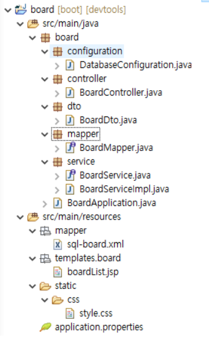

## 게시판 구현

* t_board 데이터베이스 생성


```sql
create table t_board (
	board_idx	int (11)	not null	auto_increment	comment '글 번호', 
	title		varchar(300)	not null	comment	'제목', 
	contents	text		not null	comment '내용', 
	hit_cnt		smallint(10)	not null	default '0'	comment '조회수',
	creator_id	varchar(50)	not null	comment '작성자', 
	created_datetime datetime	not null	comment '작성시간', 
	updater_id	varchar(50)	null		comment '수정자', 
	updated_datetime datetime	null		comment '수정시간', 
	deleted_yn	char(1)		not null default 'N' comment '삭제 여부', 
	primary key (board_idx)
);
```

<br/>

### 데이터전송객체 생성(DTO)

DTO : 애플리케이션 내의 각 계층간 데이터를 주고 받는데 사용하는 객체

/board/src/main/java/dto/BoardDto.java

```java
package dto;

import lombok.Data;

// t_board 테이블에 데이터를 넣고 빼고 할 때 사용할 객체
// --> 테이블의 구조와 동일(또는 유사한) 형태의 자료 구조를 가져야 한다.
@Data
public class BoardDto {
	private int boardIdx;		// board_idx
	private String title; 		// title
	private String contents; 	// contents
	private int hitCnt; 		// hit_cnt		
	private String creatorId;	// creator_id	
	private String createdDatetime;
	private String updaterId;	
	private String updatedDatetime;
}
```


### Mybatis 설정

* 테이블의 컬럼과 DTO 객체의 필터명을 자동으로 맵핑해 줄 수 있도록 프로퍼티에 Mybatis 설정

/board/src/main/resources/application.properties

```properties
mybatis.configuration.map-underscore-to-camel-case=true
```

<br/>

만들어뒀던 DatabaseConfiguration파일에 빈 추가 

/board/src/main/java/board/configuration/DatabaseConfiguration.java 

```java
@Bean
public SqlSessionFactory sqlSessionFactory(DataSource dataSource) throws Exception {
    SqlSessionFactoryBean sqlSessionFactoryBean = new SqlSessionFactoryBean();
    sqlSessionFactoryBean.setDataSource(dataSource);
    sqlSessionFactoryBean.setMapperLocations(
        applicationContext.getResources("classpath:/mapper/**/sql-*.xml")
    );
    sqlSessionFactoryBean.setConfiguration(mybatisConfig());
    return sqlSessionFactoryBean.getObject();
}

@Bean
public SqlSessionTemplate sqlSessionTemplate(SqlSessionFactory sqlSessionFactory) {
    return new SqlSessionTemplate(sqlSessionFactory);
}

@Bean
@ConfigurationProperties(prefix = "mybatis.configuration")
public org.apache.ibatis.session.Configuration mybatisConfig() {
    return new org.apache.ibatis.session.Configuration();		
}

```

<br/>

### 컨트롤러 생성

클라이언트의 요청이 들어오면 요청을 처리할 비즈니스 로직을 호출하고 그 결과를 포함하여 응답을 생성해 주는 역할을 수행

1. 컨트롤러 역할을 수행할 클래스에 @Controller 애노테이션을 추가
2. @RequestMapping 애노테이션을 이용해서 요청에 대한 주소를 지정
3. 요청 처리에 필요한 비즈니스 로직을 호출
4. 비즈니스 로직 실행 결과를 뷰로 반환

/board/src/main/java/board/controller/BoardController.java

```java
package board.controller;

import org.springframework.stereotype.Controller;
import org.springframework.web.bind.annotation.RequestMapping;
import org.springframework.web.servlet.ModelAndView;

@Controller
public class BoardController {

	@Autowired
	private BoardService boardService;
	
	@RequestMapping("/board/openBoardList.do")
	public ModelAndView openBoardList() throws Exception {
		ModelAndView mv = new ModelAndView("/board/boardList");
		List<BoardDto> list = boardService.selectBoardList();
		mv.addObject("list", list);
		return mv;
	}
}
```

<br/>

### 서비스 생성

인터페이스와 구현 클래스로 구성

/board/src/main/java/board/service/BoardService.java

```java
package board.service;

import java.util.List;

import dto.BoardDto;

public interface BoardService {

	// 게시판 목록 조회 기능을 정의
	List<BoardDto> selectBoardList() throws Exception; 
}
```

/board/src/main/java/board/service/BoardServiceImpl.java

```java
package board.service;

import java.util.List;

import org.springframework.stereotype.Service;

import board.dto.BoardDto;

@Service
public class BoardServiceImpl implements BoardService {

	@Autowired
	private BoardMapper boardMapper;
	
	@Override
	public List<BoardDto> selectBoardList() throws Exception {
		return boardMapper.selectBoardList();
	}
}
```

<br/>

### 맵퍼생성

MyBatis는 DAO를 만드는 것 보다는 SqlSessionDaoSupport 또는 SqlSessionTemplate 사용을 권장

```java
package board.mapper;

import java.util.List;

import org.apache.ibatis.annotations.Mapper;

import board.dto.BoardDto;

@Mapper
public interface BoardMapper {
	List<BoardDto> selectBoardList() throws Exception;
}
```

<br/>

### SQL 작성

select 기능 추가

/board/src/main/resources/mapper/sql-board.xml

```xml
<?xml version="1.0" encoding="UTF-8"?>
<!DOCTYPE mapper PUBLIC "-//mybatis.org//DTD Mapper 3.0/EN" "http://mybatis.org/dtd/mybatis-3-mapper.dtd">

<mapper namespace="board.mapper.BoardMapper">
	<select id="selectBoardList" resultType="board.dto.BoardDto">
		<!-- CDATA 섹션 -->
		<![CDATA[
			select board_idx, title, hit_cnt, 
			       date_format(created_datetime, '%Y.%m.%d %H:%i:%s') as created_datetime
		      from t_board
		     where deleted_yn = 'N'
		     order by board_idx desc
		]]>
	</select>
</mapper>
```

<br/>

---

## 프로젝트 구조

