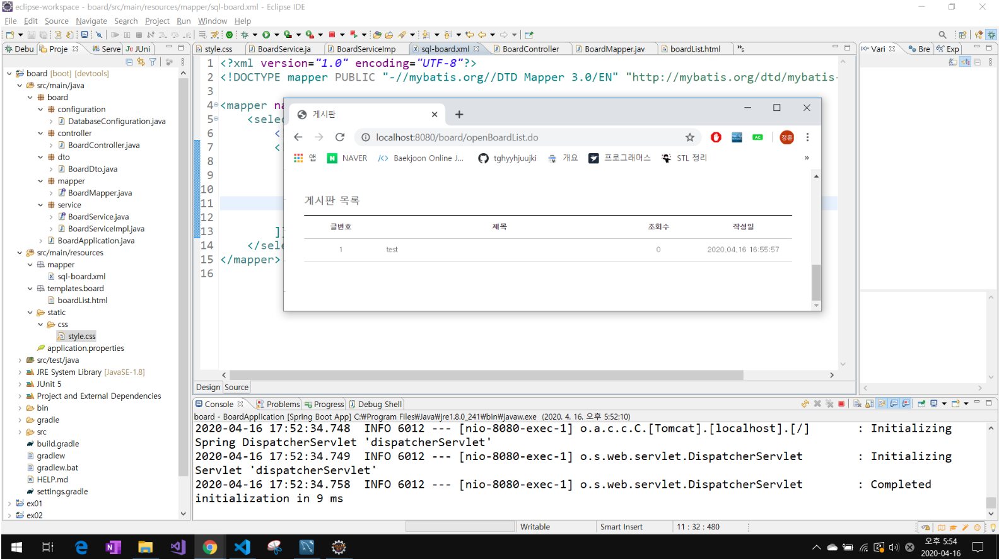

### 화면 뷰 구성

/board/src/main/resources/templates/board/boardList.html

```html
<!DOCTYPE html>
<html lang="ko" xmlns:th="http://www.thymeleaf.org">
<head>
	<meta charset="UTF-8" />
	<title>게시판</title>
	<link rel="stylesheet" th:href="@{/css/style.css}"/>	
</head>
<body>
	<div class="container">
		<h2>게시판 목록</h2>
		<table class="board_list">
			<colgroup>
				<col width="15%"/>
				<col width="*"  />
				<col width="15%"/>
				<col width="20%"/>
			</colgroup>
			<thead>
				<tr>
					<th scope="col">글번호</th>
					<th scope="col">제목</th>
					<th scope="col">조회수</th>
					<th scope="col">작성일</th>
				</tr>
			</thead>
			<tbody>
				<tr th:if="${#lists.size(list)} > 0" th:each="list : ${list}">
					<td th:text="${list.boardIdx}"></td>
					<td class="title" th:text="${list.title}"></td>
					<td th:text="${list.hitCnt}"></td>
					<td th:text="${list.createdDatetime}"></td>
				</tr>
				<tr th:unless="${#lists.size(list)} > 0">
					<td colspan="4">조회 결과가 없습니다.</td>
				</tr>
			</tbody>		
		</table>
	</div>
</body>
</html>
```

<br/>

src/main/resources/static/css/style.css

```scss
@CHARSET "UTF-8";

@import url(http://fonts.googleapis.com/earlyaccess/nanumgothic.css);

@import
	url(http://cdn.jsdelivr.net/font-nanum/1.0/nanumbarungothic/nanumbarungothic.css)
	;

html {
	overflow: scorll;
}

html, body, div, h1, h2, a, form, table, caption, thead, tbody, tr, th,
	td, submit {
	margin: 0;
	outline: 0;
	border: 0;
	padding: 0;
	font-size: 100%;
	vertical-align: baseline;
	background: transparent;
}

body {
	font-size: 0.875em;
	line-height: 1.5;
	color: #666;
	-webkit-text-size-adjust: none;
	min-width: 320px;
	font-family: 'NanumGothic', '나눔고딕', dotum, "Helvetica Neue", Helvetica,
		Verdana, Arial, Sans-Serief;
}

h1, h2, h3 {
	font-size: 1.5em;
}

p {
	margin: 0;
	padding: 0;
}

ul {
	margin: 0;
}

a:link, a:visited {
	text-decoration: none;
	color: #656565;
}

input {
	vertical-align: middle;
}

input:focus {
	outline: 0;
}

caption {
	display: none;
	width: 0;
	height: 0;
	margin-top: -1px;
	overflow: hidden;
	visibility: hidden;
	font-size: 0;
	line-height: 0;
}

.container {
	max-width: 1024px;
	margin: 30px auto;
}

.board_list {
	width: 100%;
	border-top: 2px solid #252525;
	border-bottom: 1px solid #ccc;
	margin: 15px 0;
	border-collapse: collapse;
}

.board_list thead th:first-child {
	background-image: none;
}

.board_list thead th {
	border-bottom: 1px solid #ccc;
	padding: 13px 0;
	color: #3b3a3a;
	text-align: center;
	vertical-align: middle;
}

.board_list tbody td {
	border-top: 1px solid #ccc;
	padding: 13px 0;
	text-align: center;
	vertical-align: middle;
}

.board_list tbody tr:first-child td {
	border: none;
}

.board_list tbody tr:hover {
	background: #ffff99;
}

.board_list tbody td.title {
	text-align: left;
	padding-left: 20px;
}

.board_list tbody td a {
	display: inline-block
}

.board_detail {
	width: 100%;
	border-top: 2px solid #252525;
	border-bottom: 1px solid #ccc;
	border-collapse: collapse;
}

.board_detail tbody input {
	width: 100%;
}

.board_detail tbody th {
	text-align: left;
	background: #f7f7f7;
	color: #3b3a3a;
	vertical-align: middle;
	text-align: center;
}

.board_detail tbody th, .board_detail tbody td {
	padding: 10px 15px;
	border-bottom: 1px solid #ccc;
}

.board_detail tbody textarea {
	width: 100%;
	min-height: 170px
}

.btn {
	margin: 5px;
	padding: 5px 11px;
	color: #fff !important;
	display: inline-block;
	background-color: #7D7F82;
	vertical-align: middle;
	border-radius: 0 !important;
	cursor: pointer;
	border: none;
}

.btn:hover {
	background: #6b9ab8;
}

.file_list a {
	display: inherit !important;
}
```

<br/>

### 실행화면

