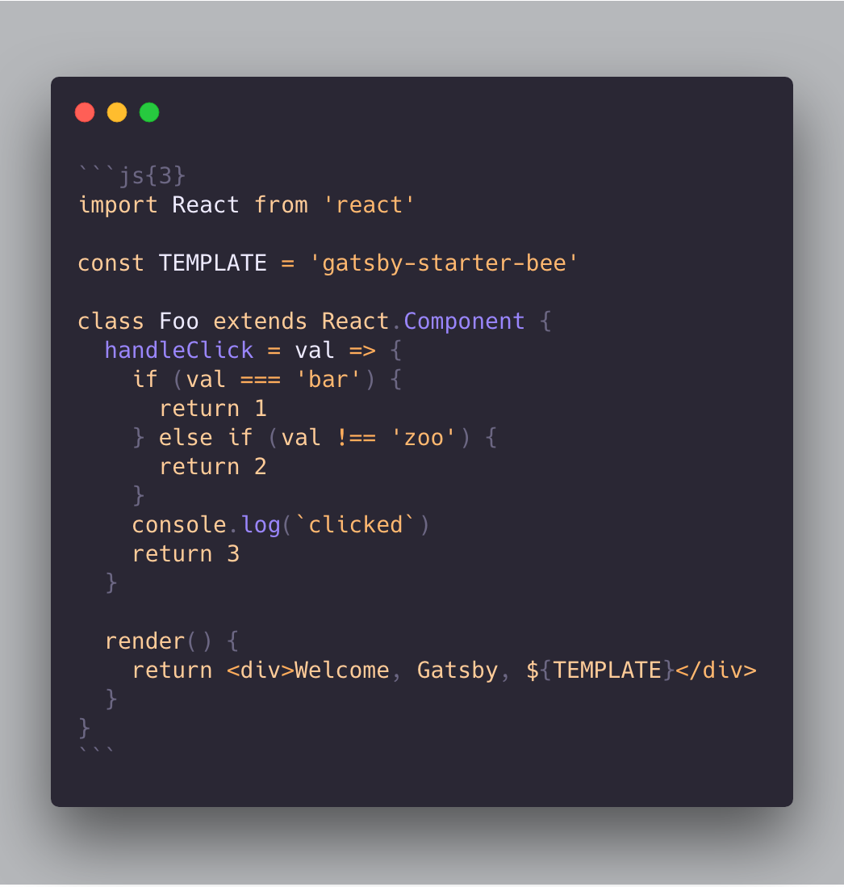

Welcome, Gatsby! This starter is full-package for your new blog!

## 1. Support Four frontmatter

```
---
title: 'Welcome Bee starter'
date: 2019-2-6 16:21:13
category: 'development'
draft: false
---
```

1. title
2. date
3. category
4. draft

## 2. Code highlighting

1. With [Fira Code](https://github.com/tonsky/FiraCode) font
2. Support highlighting with [prism](https://github.com/PrismJS/prism)
   2-1. Use inline highlighting

```js{3}
import React from 'react'

const TEMPLATE = 'gatsby-starter-bee'

class Foo extends React.Component {
  handleClick = val => {
    if (val === 'bar') {
      return 1
    } else if (val !== 'zoo') {
      return 2
    }
    console.log(`clicked`)
    return 3
  }

  render() {
    return <div>Welcome, Gatsby, ${TEMPLATE}</div>
  }
}
```

_code_



## 3. Support Markdown (h2)

1. With [Noto Sans](https://fonts.google.com/specimen/Noto+Sans) font
2. Support header anchoring

### h3

#### h4

##### h5

> quote!

**bold** _italic_

## 4. Support emoji :rocket:

Based on [emojione](https://github.com/emojione/emojione) :pray:

## 5. Support light/dark mode

## 6. Support social sharing feature

1. Twitter
2. Facebook

### Bonus, `Buy me a coffee` button

Set, `buyMeACoffeeId` of `gatsby-meta-config.js`

## 7. Comments feature

You can add comments feature by selecting one of them.

- [ ] Disqus
- [ ] utterances

## 8. Support latex

Support latex rendering with katex plugin.

```tex
$$\prod_{i=a}^{b} f(i)$$
```

$$\prod_{i=a}^{b} f(i)$$

## 9. Other features of this template

1. You can add resume to `/about`
2. Lazy rendering
3. Scroll restoration
4. Categorize posts
5. Offline caching with service worker (based gatsby)
6. Support GA(Google Analytics)

> Let's Start! [Go](https://github.com/JaeYeopHan/gatsby-starter-bee)
