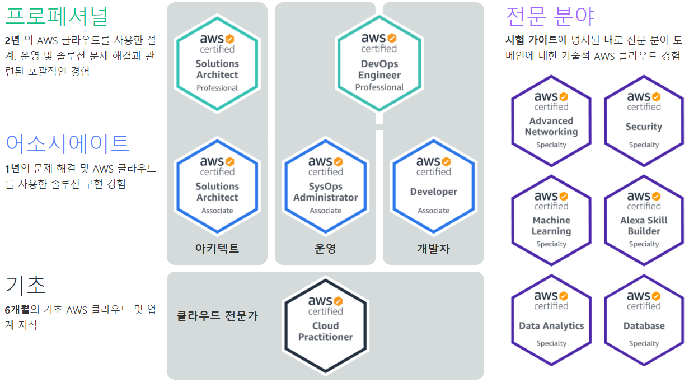
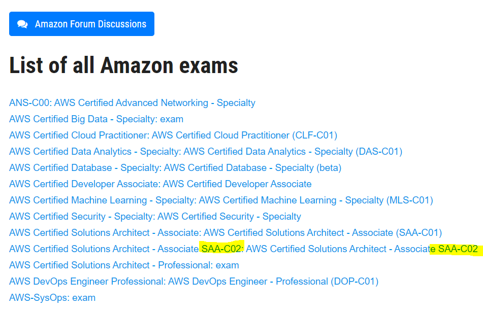
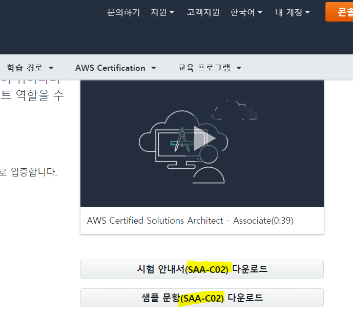
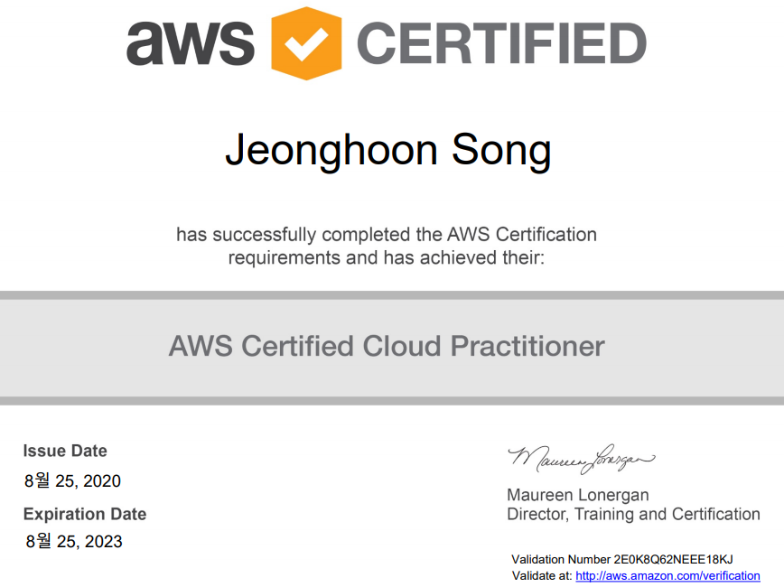

AWS(Amazon Web Service)에서는 본인들의 서비스에 대한 다음의 자격증을 발급한다. 생각보다 시험비가 싸지 않으므로 본인의 목적에 맞게 준비하고 취득하는 것이 좋아보인다.

- Practitioner  -100$
- Associate - 150$
- Professional - 300$
- Specialty - 300$

`AWS Solutions Architect - Associate` 을 준비하면서, 시험에 합격하면 다음 시험을 50% 할인해 준다는 사실을 알게됐다. `Associate`를 단독으로 보면 150$이지만,`Pracatitioner ` + Associate 는 100$ +75$로 25$밖에 차이 나지 않았다. 그게 내가 `Practitioner` 를 따게 된 이유이다.

 

`Practitioner`는 문제 자체가 AWS의 기본적인 개념과 서비스 역할에 대해서 묻는 것이 대부분이지만, Aws를 실제로 사용하지 않은 사람은  처음에 방향잡기가 어려울 수 있다.

나는 다음과 같이 공부했다

[AWS 한글백서](https://d1.awsstatic.com/whitepapers/ko_KR/aws-overview.pdf) 에서 먼저 기본을 다잡고

https://www.examtopics.com/exams/amazon/ 여기에서 기출문제를 공부했다.

아래 목록에서 본인이 볼 시험에 맞는 문제를 선택하면 된다.

참고로 각 시험마다 일련번호가 부여 되어 있기 때문에 그에 맞는 덤프를 풀면 된다. 일련번호마다 문제 pool이 다르다. 다음은  `AWS Solutions Architect - Associate`  의 예이다. Aws에서 현재 문제의 일련번호를 확인 후 그에 맞는 문제를 풀자.

 

시험은 한글로 보는 것을 권장한다. 한글로 보면 한글 번역본 뿐만 아니라 영어 원문도 볼 수 있기 때문이다.

요즘 친하게 지내는 친구와 같이 공부했는데, 생각보다 재밌게 공부했고 둘 다 여유롭게 합격해서 더 뿌듯했다.

