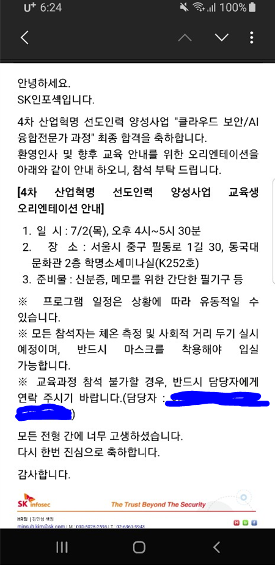

삼성 멀티캠퍼스에서 6개월 간의 클라우드 MSA 교육이 끝나고 3일 뒤에 바로 SKCT를 봤다. 주말이 껴 있었기 때문에 문제집이 시험 전 날 도착했다. ''이건 망했다'' 하고 마음 놓고 시험봤는데, 덜컥 붙어버렸다. 

결과 나오고 바로 다음주에 AI면접으로 한번 더 거르고

합격했다.

오리엔테이션 바로 다음날부터 교육에 들어갔다.

기존에 합격해 놓았던 42서울 입과를 취소하고 바로 교육을 받을 준비를 했다.

다만...

 

입사하게 되면 대부분 인원이 2~3년 동안 보안관제로 투입된다고 한다.

연봉이 낮은건 상관없지만, 2~3년 동안 모니터링을 해야한다는 것에 괴리감이 심했다.

 

지금부터 3년이면 현업에서 많은 것을 배워야 할 시기인데...

코로나 문제로 앞으로도 취업이 어려울 것이란 걱정에 생각이 많아지는 하루였다.

참.. 붙어도 문제다 ㅠㅠ